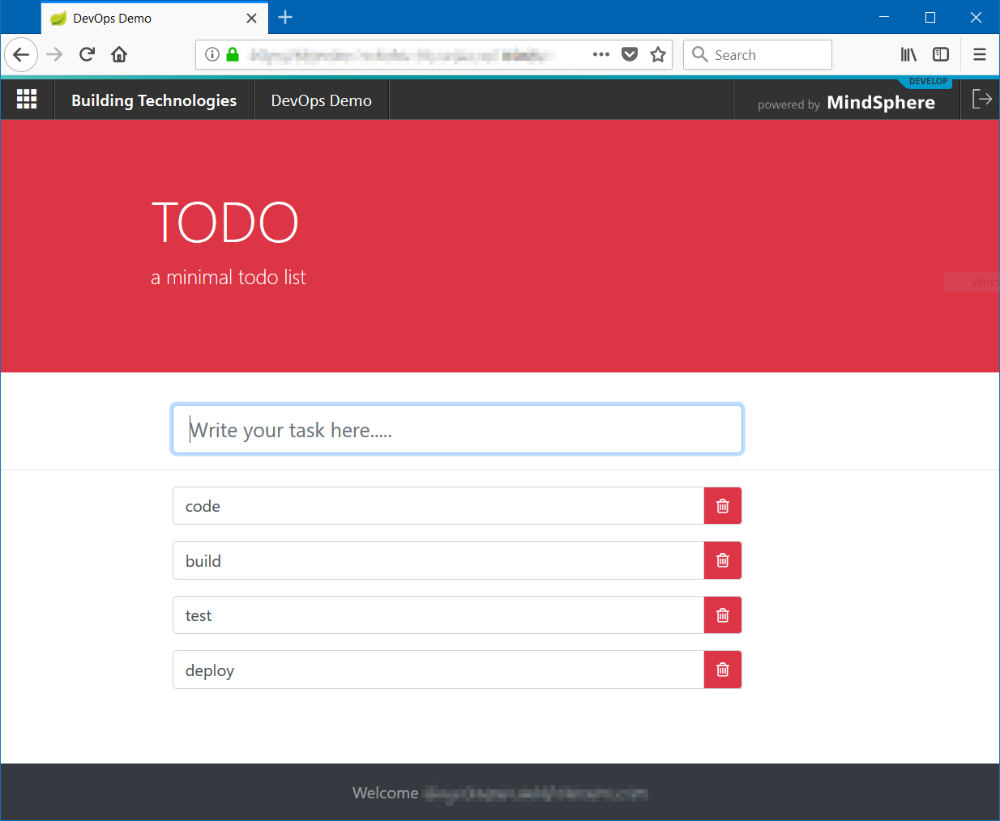

# MindSphere DevOps Demo



Close interaction of development and operations is essential to accelerate
delivery of applications. This is a demo across the whole DevOps cycle with
MindSphere, by using well known and widely used open source tools.

High level architecture diagram (draw.io png with embedded xml):


The demo consists of:

- a simple todo app using the MEAN (MongoDB, Express.js, Angular, Node.js) stack
  - Angular App (root folder)
  - [Backend](server)
- a devops admin backend that provides access to prometheus and grafana
  - [devopsadmin app](devops/devopsadmin/)
  - [Prometheus on CloudFoundry](devops/prometheus)
  - [Grafana on CloudFoundry](devops/grafana)

Additionally, [tooling to ease ssh connectivity to running cf applications](tools/README.md)
is provided.

Please refer to the official MindSphere & CloudFoundry developer documentation
for detailed information about the platform:

- https://developer.mindsphere.io/
- https://docs.cloudfoundry.org/devguide/

## Todo app

The todo app provides examples on CI/CD including unit and e2e tests.

### Backend Configuration

The following environment variables are recognized by the todo backend:

| Variable     | Description | Required | Default |
|--------------|-------------|----------|---------|
| `JWKS_URI`   | JWKS endpoint, contains key used for validating auth tokens     | only on MindSphere deploy | *empty* |
| `JWT_ISSUER` | Expected issuer of the token to be found in the JWT `iss` field | only on MindSphere deploy | *empty* |

### Local run

```sh
# Start mongodb server
docker run -p 27017:27017 mongo
# Build static angular ap and start nodejs server
yarn
yarn build --prod
cd server
yarn
yarn start
```

### Deploy to MindSphere

Use `cf login` to connect via cli and make sure you can interact with the
MindSphere CloudFoundry backend. Follow the
[MindSphere developer documentation](https://developer.mindsphere.io).

Before deploying, ensure that the appropriate cloudfoundry services are
available:

- The mongodb service is required. You can choose whichever name you please,
  the app will auto-discover it on startup:

    ```sh
    cf create-service mongodb32 mongodb-xs todo-mongodb
    ```

- Create the LogMe (ELK) service for log aggregation. This is
  *not a requirement*, and the same service can be used to aggregate any
  number of app logs. The MindSphere platform will automatically gather
  the logs after binding:

    ```sh
    cf create-service logme logme-xs todo-logme
    ```

Build & push the todo app, set authentication environment variables, and
bind the services:

```sh
# Build static angular app
yarn
yarn build --no-progress --prod
# Push nodejs server
cd server
yarn
cf push todo --no-start
cf set-env todo JWKS_URI "${JWKS_URI}"
cf set-env todo JWT_ISSUER "${JWT_ISSUER}"
cf bind-service todo todo-mongodb
cf bind-service todo todo-logme
cf start todo
```

(*Only once*) in the MindSphere Developer Cockpit, some CSP policy adaptations
are needed:

- allow connections to the OpenAPI specs hosted on `developer.mindsphere.io`
- allow connections to the piam endpoint of the gateway; this is required
  for login redirects when the user session token expires

Example (substitute `<your-tenant>` by your tenant identifier):

```
default-src 'self' <your-tenant>.piam.eu1.mindsphere.io developer.mindsphere.io static.eu1.mindsphere.io;
```

More information under: https://developer.mindsphere.io/concepts/concept-csp.html

### Live development server

Run `ng serve` for a dev server. Navigate to `http://localhost:4200/`. The app
will automatically reload if you change any of the source files.

### Live development server (with todo api server)

1. Run the todo api server available on the `server/` directory. This will
    start the api server on `http://localhost:3000`
1. Run `yarn start`. Navigate to `http://localhost:4200/`. The app will proxy
    api calls to `http://localhost:3000` and automatically reload if you change
    any of the source files

### Code scaffolding

Run `ng generate component component-name` to generate a new component. You can
also use `ng generate directive|pipe|service|class|guard|interface|enum|module`.

### Build static Angular UI

Run `ng build` to build the project. The build artifacts will be stored in the
`dist/` directory. Use the `--prod` flag for a production build.

### Running unit tests

Run `ng test` to execute the unit tests via [Karma](https://karma-runner.github.io).

### Running end-to-end tests

Run `ng e2e` to execute the end-to-end tests via [Protractor](http://www.protractortest.org/).

### Further help

To get more help on the Angular CLI use `ng help` or go check out the
[Angular CLI README](https://github.com/angular/angular-cli/blob/master/README.md).

## Known Issues / Limitations

- The [gitlab-ci](.gitlab-ci.yml) integration requires manually setting
  authentication with access and refresh tokens available as protected
  [CI/CD Gitlab Variables](https://docs.gitlab.com/ce/ci/variables/),
  and they need to be renewed every 30 days. This can be copied directly from
  your CloudFoundry CLI `~/.cf/config.json` file after successful `cf login`.
- Storage for [Prometheus](devops/prometheus) is currently transient, pending
  support for some kind of dynamic persistent storage for apps, or direct
  support for Prometheus in MindSphere.
- Prometheus metrics http endpoints are read-only but not protected.

## License

This project is licensed under the MIT License
