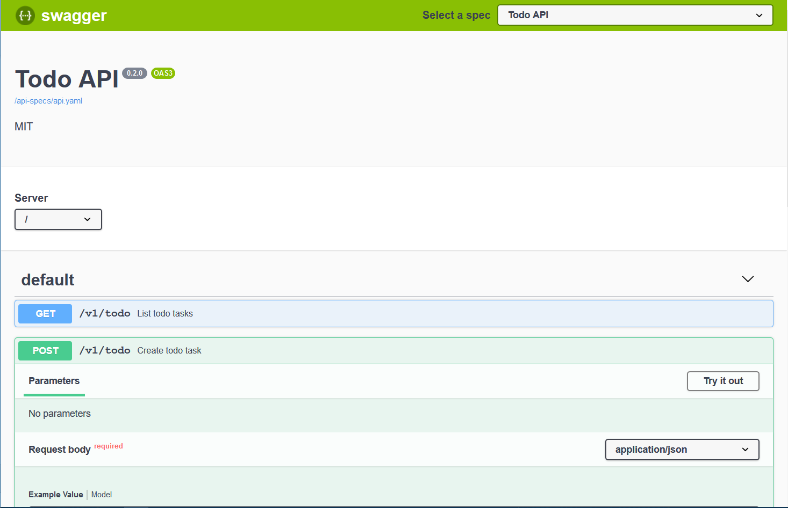
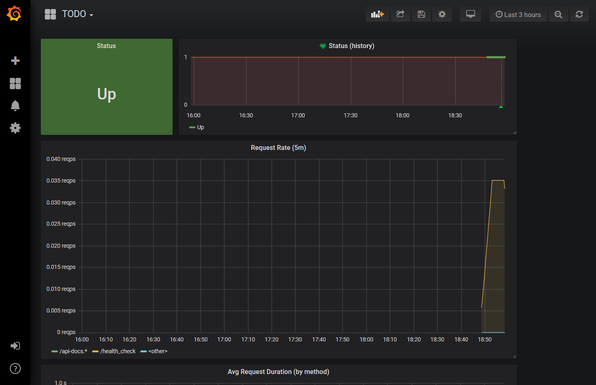

# MindSphere DevOps Demo






Close interaction of development and operations is essential to accelerate
delivery of applications. This is a demo across the whole DevOps cycle with
MindSphere, by using well known and widely used open source tools.

High level architecture diagram (draw.io png with embedded xml):


The demo consists of:

- a simple todo app using the MEAN (MongoDB, Express.js, Angular, Node.js) stack
  - Angular App (root folder)
  - [Backend](server)
    - the backend provides swagger-ui for navigating both the server apis and
      the MindSphere APIs (under `/api-docs`)
  - local Angular dev server setup that proxies requests to MindSphere,
    allowing local development
- a devops admin backend that provides access to prometheus and grafana
  - [devopsadmin app](devops/devopsadmin)
  - [Prometheus on CloudFoundry](devops/prometheus)
  - [Grafana on CloudFoundry](devops/grafana)

Additionally, [tooling to ease ssh connectivity to running cf applications](tools/README.md)
is provided.

Please refer to the official MindSphere & CloudFoundry developer documentation
for detailed information about the platform:

- https://developer.mindsphere.io/
- https://docs.cloudfoundry.org/devguide/

## Todo app

The todo app provides examples on CI/CD including unit and e2e tests.

### Backend Configuration

The following environment variables are recognized by the todo backend:

| Variable     | Description | Required | Default |
|--------------|-------------|----------|---------|
| `MDSP_TENANT` | MindSphere tenant identifier | only on MindSphere deploy | *empty* |
| `MDSP_REGION` | MindSphere region identifier | only on MindSphere deploy | *empty* |

### Local Development

This project includes support for running the web interface in local
development mode connected to MindSphere. In order to reach the MindSphere
APIs you need to provide user credentials for your user.

The local Angular development server is setup to use a local proxy based on
WebPack that forwards api requests:

- `/api/**` will be forwarded to `https://gateway.<MDSP_REGION>.mindsphere.io`  
  This applies to all [MindSphere API calls](https://developer.mindsphere.io/apis/index.html).
  You can check the [MindSphere service source](src/app/mindsphere.service.ts)
  for a sample.
- `/v1/**` will be forwarded to `http://localhost:3000`  
  This applies to all local Node.js todo backend server API calls. You can
  start the backend locally from the `server/` directory.

To be able to reach the MindSphere APIs from your local environment you need
to setup authentication credentials for the MindSphere `/api/**` endpoints.
Please note the next steps are only needed if you call directly MindSphere
APIs from your frontend. They are not needed to interact with the local
todo API backend.

1. As a first one-time step you need to register your application in the
    MindSphere Developer Cockpit by following the [official documentation](https://developer.mindsphere.io/howto/howto-cf-running-app.html#configure-the-application-via-the-developer-cockpit)
    - Create the application
    - Register endpoints (a single `/**` is enough for this app)
    - **IMPORTANT** Configure the [application Roles & Scopes](https://developer.mindsphere.io/howto/howto-cf-running-app.html#configure-the-application-roles-scopes)
      Your application will only have access to the MindSphere APIs that are
      configured in this step. Also assign the core role `mdsp:core:tm.tenantUser`
      or the MindSphere OS Bar won't be able to show the tenant information
    - Register the application
    - Assign the application scopes to the users that should have access (in the
      tenant Settings app)
1. Access your new application with a web browser and authenticate. On
    successful authentication the MindSphere gateway will setup some session
    cookies. Use the browser developer tools to copy the cookies `SESSION`
    and `XSRF-TOKEN`
1. Create a file `src/environments/.environment.mdsplocal.ts` (notice the dot
    in the name) with the same contents as `src/environments/environment.ts`.
    This file will be ignored by git
1. In this file set the variables `xsrfTokenHeader` and `sessionCookie`
    to the values copied before
1. These [credentials will be valid](https://developer.mindsphere.io/concepts/concept-gateway-url-schemas.html#restrictions)
    for a maximum of 12 hours and have an inactivity timeout of 30 minutes.
    When they expire, you can execute the same flow again by logging in to
    MindSphere

Then start the local todo backend and Angular dev server. You will be able
to enjoy live reload of changes done in the source code of the Angular
app:

```sh
# Start mongodb server
docker run -p 27017:27017 mongo

# Start nodejs backend
yarn --cwd server
yarn --cwd server start

# Start Angular dev server
yarn
yarn start
```

Now load `http://localhost:4200`

You can also reach the API navigator under `http://localhost:3000/api-docs`

### Deploy to MindSphere

We provide a manifest file to be used for deployment to MindSphere:

- The manifest uses `random-route: true`, this will create the application
  with a random internal route to ensure no naming conflicts with other apps
  in the same space (e.g. `todo-funny-chipmunk.apps.eu1.mindsphere`)
- Please note that if you intend later to deploy devopsadmin, Grafana and
  Prometheus, you'll need to set in their configuration the appropriate
  internal random name assigned by the route directive
- Take a look at the `.gitlab-ci.yml` file for an example of an actual
  deployment performed by our CI pipeline

Use `cf login` to connect via cli and make sure you can interact with the
MindSphere CloudFoundry backend. Follow the
[MindSphere developer documentation](https://developer.mindsphere.io).

Before deploying, ensure that the appropriate cloudfoundry services are
available:

- The mongodb service is required. You can choose whichever name you please,
  the app will auto-discover it on startup:

    ```sh
    cf create-service mongodb32 mongodb-xs todo-mongodb
    ```

- Create the LogMe (ELK) service for log aggregation. This is
  *not a requirement* and you could remove it from the manifest definition
  The same service can be used to aggregate any
  number of app logs. The MindSphere platform will automatically gather
  the logs after binding:

    ```sh
    cf create-service logme logme-xs todo-logme
    ```

Build & push the todo app, set authentication environment variables, and
bind the services:

```sh
# Build static angular app into the server/ directory
yarn
yarn build:prod --no-progress

# Push nodejs server
yarn --cwd server
cf push --var mdspTenant="${MDSP_TENANT}" --var mdspRegion="${MDSP_REGION}"
```

(*Only once*) in the MindSphere Developer Cockpit, some CSP policy adaptations
are needed on the `default-src` directive:

- allow connections to the OpenAPI specs hosted on `developer.mindsphere.io`
- allow connections to the piam endpoint of the gateway; this is required
  for login redirects when the user session token expires

Example (substitute `<your-tenant>` and `<your-region>` accordingly):

```
default-src 'self' <your-tenant>.piam.<your-region>.mindsphere.io developer.mindsphere.io static.<your-region>.mindsphere.io;
```

More information under: https://developer.mindsphere.io/concepts/concept-csp.html

### Live development server

Run `ng serve` for a dev server. Navigate to `http://localhost:4200/`. The app
will automatically reload if you change any of the source files.

### Live development server (with todo api server)

1. Run the todo api server available on the `server/` directory. This will
    start the api server on `http://localhost:3000`
1. Run `yarn start`. Navigate to `http://localhost:4200/`. The app will proxy
    api calls to `http://localhost:3000` and automatically reload if you change
    any of the source files

### Code scaffolding

Run `ng generate component component-name` to generate a new component. You can
also use `ng generate directive|pipe|service|class|guard|interface|enum|module`.

### Build static Angular UI

Run `ng build` to build the project. The build artifacts will be stored in the
`dist/` directory. Use the `--prod` flag for a production build.

### Running unit tests

Run `ng test` to execute the unit tests via [Karma](https://karma-runner.github.io).

### Running end-to-end tests

Run `ng e2e` to execute the end-to-end tests via [Protractor](http://www.protractortest.org/).

### Further help

To get more help on the Angular CLI use `ng help` or go check out the
[Angular CLI README](https://github.com/angular/angular-cli/blob/master/README.md).

## Known Issues / Limitations

- The [gitlab-ci](.gitlab-ci.yml) integration requires manually setting
  authentication with access and refresh tokens available as protected
  [CI/CD Gitlab Variables](https://docs.gitlab.com/ce/ci/variables/),
  and they need to be renewed every 30 days. This can be copied directly from
  your CloudFoundry CLI `~/.cf/config.json` file after successful `cf login`.
- Storage for [Prometheus](devops/prometheus) is currently transient, pending
  support for some kind of dynamic persistent storage for apps, or direct
  support for Prometheus in MindSphere.
- Prometheus metrics http endpoints are read-only but not protected.

## License

This project is licensed under the MIT License
